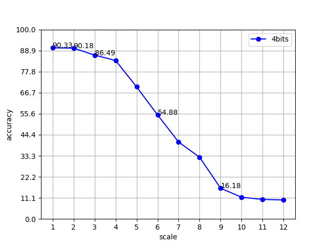

# Quantized model on chip.

### algorithm example:

### Train
float_train.py :  

	1. 訓練 float model
	2. 將 float model 中的 conv2d 和 bn 合併
	3. 訓練quantized model並存出 weights 和 bias 以及每一層的最大值最小值(scale factor)
   
### Inference
quan_forward.py  

	測試bit_shift效果

#### result:	
keepbit-accuracy curve

postquan_forward.py

	bit分開進行convolution然後scale之後再加總

#### result:	
keepbit-accuracy curve

### Compare parameters:
name \ model type |   float-point  |  quan-4  | 
----------------|:---------:|:---------:|
total params    | 1,649,034 | 1,647,498 |
forward speed   | ?         |        ?  |
params size(MB) |  6.29     |   0.78    |  
